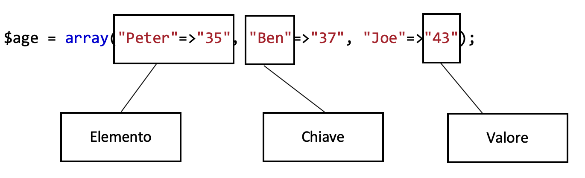

# **Array**

### Elementi degli array



Elemento => L’elemento è composto dalla chiave e il valore  
Chiave => La chiave sostituisce l’indice che deve essere unica per riconoscere il valore  
Valore => Il valore è ciò che deve essere memorizzato  


### Definizione degli array

Per definire gli array, vi sono 2 metodi, entrambi utilizzano il metodo `array()`.  
Il primo metodo permette di inserire i valori nell'array, mentre il secondo permette di inserire i 
valori, assegnadoli una key.

**Primo metodo:**  
Come detto sopra, con questo metodo si pu&ograve; inserire degli elementi ad un array, mentre lo si 
crea, con questo metodo le chiavi vengono generate automaticamente, con un numero proggressivo, con
inizio da `0`.

```php
<?php
$array = array("Value1", "Value2", "Value3");
?>
```

`$array` &egrave; il nome dell'array, `array();` &egrave; il metodo che permette di creare un array
ed assegnargli i valori, ed le stringhe fra le virgolette ("Value1", "Value2", "Value3") sono i
valori contenuti nell'array.

**Secondo metodo:**  
Con questo altro metodo invece si possono inserire degli elementi ad un array, mentro lo si 
instanzia ed ad ogni valore inserito gli si assegna una chiave.

```php
<?php
$array = array("Key1"=>"Value1", "Key2"=>"Value2", "Key3"=>"Value3");
?>
``` 

`$array` &egrave; il nome dell'array, `array();` &egrave; il metodo che permette di instanziare un
array, gli elementi sono composti da una key e da un valore `"Key"=>"Value"`, si assegna ad ogni key
(che deve essere univoca) un valore.

### Aggiunta elementi con [] 

La sintassi per aggiungere un nuove elemento all’interno di un array è la seguente.

```php
<?php
$array["keyX"] = "Value";
?>
```

oppure 

```php
<?php
$array[2] = "Value";
?>
```

### conteggio e numero elementi

Il metodo count si occupa di contare i valori all’interno dell’array.
```php
<?php
$cars = array("Volvo", "BMW", "Toyota");
$arrlength = count($cars);
?>
```


### foreach() &amp; array

Il foreach ripete il ciclo per ogni elemento presente nell’array.

```php
<?php
foreach($array as $key => $value) {
    echo "Key" . $key . ", Value=" . $value;
}
?>
```

### foreach() inserire un array in una tabella

Per inserire un elemento all’interno di una tabella tramite un foreach si stampa si apre la tabella 
tramite il  
Echo "<Table>";  
Si apre la colonna con  
Echo "<tr>";  
e si inseriscono le righe  
echo "<td>".$age"</td>";  
si chiude la colonna e la tabella con  
Echo "</tr>";  
Echo "</Table>";  

```php
<?php
echo "<Table>";
echo "<tr>";
foreach($array as $key => $value) {
    echo "<td>" . $value . "</td>";
}
echo "</tr>";
echo "</Table>";
?>
```

### for() vs foreach()

Per scorrere una array con un for è molto semplice, tramite il for si dichiara un contatore che 
viene incrementa a ogni ciclo fino a quando rispetta la condizione inserita all’interno del for.

```php
<?php
for ($i = 0; $i < count($array); $i++) {
    echo $array[$i];
}
?>
```

La differenza con foreach è che con il for bisogna dichiarare un contatore e una condizione che dice 
fino a quando deve continuare il ciclo mentre con un foreach non c’è nessun contatore ma bisogna 
passare tutti gli elementi di un array.


### trovare elementi in array

Per trovare un elemento in un array si possono usare le key oppure i valori. Usando le key a 
a dipnedenza di quale metodo &egrave; stato utilizzato per inizializzare l'array vi sono metodi
diversi per trovare il valore dell'elemento.

Se come si &egrave creato l'array con il metodo senza le key personalizzate, bisogna utilizzare 
l'index del elemento.

```php
<?php
$array[0];
?>
```

In questo caso si trova il primo valore dell'array.

Mentre se si utlizzano le key bisogna mettere nelle parentesi quadre la key del valore desiderato.
```php
<?php
$array["key"];
?>
```

Per trovare un elemento con la key bisogna utilizzare il metodo `array_search()`.

```php
<?php
$array=array("Key1"=>"Value1","Key2"=>"Value2","Key3"=>"Value3");
echo array_search("Value1",$array);
?>
```

Questo ritorna il metodo "Key1"

### rimozione elemento da un array

Per rimuovere dei valori da un array, bisogna utilizzare il metodo `unset()`.

```php
<?php
$array=array("Key1"=>"Value1","Key2"=>"Value2","Key3"=>"Value3");
    \unset($array["Key2"]);
?>
```

Qui &egrave stato rimosso il valore con la chiave "Key2".

### metodi sugli array

#### implode()

Questo metodo permette di unira delle stringhe di un array inserendo una stringa a scelta fra di esse.

```php
<?php
$array = array("Ciao", "come", "va", "?");
$text = implode(" ", $array);
?>
```

#### explode()
Questo metodo permette di suddividere una stringa unica in un array di stringhe tramite un carattere divisore.


```php
<?php
$text = "Ciao come va ?";
$array = explode(" ", $text);
?>
```

#### sort()

Questo metodo permette di ordinare un array dal pi&ugrave; piccolo o in ordine alfabetico(Rsort() lo ordina al contrario).

```php
<?php
$array = array("Ciao", "come", "va");
sort($array);
?>
```

#### asort()
Questo metodo permette di ordinare un array associativo dal pi&ugrave; piccolo o in ordine alfabetico a seconda del valore (Arsort() lo ordina al contrario).

```php
<?php
$array = array("Ciao"=>"Hello", "Come"=>"How", "va"=>"are you doing");
asort($array);
?>
```

#### ksort()
Questo metodo permette di ordinare un array dal pi˘ piccolo o in ordine alfabetico a seconda della chiave (Krsort() lo ordina al contrario).

```php
<?php
$array = array("Ciao"=>"Hello", "come"=>"how", "va"=>"are you doing");
ksort($array);
?>
```

### array multidimensionali

Scorrere gli elementi di un array multidimensionale:

```php
<?php
$cars = array
  (
  array("Volvo",22,18),
  array("BMW",15,13),
  array("Saab",5,2),
  array("Land Rover",17,15)
  );
// Metodo for():
for ($i = 0; $i < count($cars); $i++) {
  for ($j = 0; $j < count($cars[$i]); $j++) {
    echo $cars[$i][$j];
  }
}
// Metodo foreach():
foreach ($cars as $x => $xvalue) {
  foreach ($cars[$x] as $y => $yvalue) {
    echo $yvalue;
  }
}
?>
```